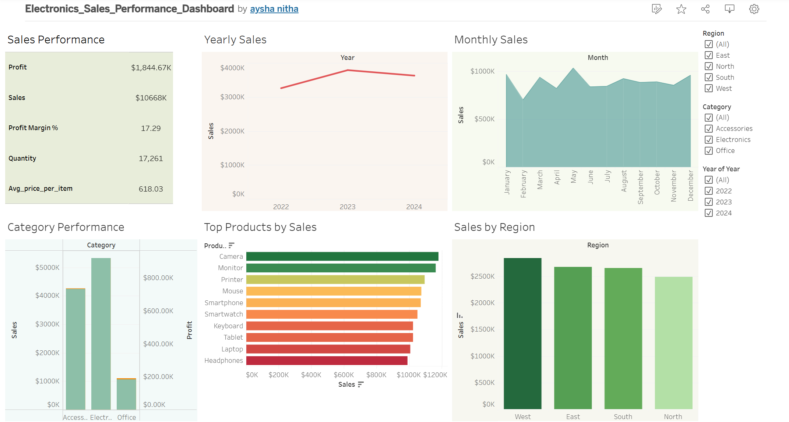

# data-analysis-portfolio
Developed a portfolio site to showcase data analysis projects

# Electronics Sales Dashboard

## Project Overview

This project analyses fictitious sales data for electronic products to identify key business insights, such as monthly trends, top-performing products, and regional performance.

## Tools Used

* SQL (Google BigQuery)
* Tableau
* Github

## Dataset

The dataset includes:

* Order Date
* Product Name
* Category
* Region
* Quantity
* Sales
* Profit

## Key Analysis

* Monthly Trends
* Yearly Sales
* Top Performing Products
* Category Performance
* Regional Performance
* Profit Margin Analysis

## Dashboard

Results are visualized in the Tableau dashboard linked below.

https://public.tableau.com/app/profile/aysha.nitha/vizzes

## Key Insights

• The West region generates the highest sales among all regions
• Electronics is the top-performing category in both sales and profit
• Sales peaked in 2023, followed by a slight decline in 2024
• Monthly trends show a peak around May with relatively stable performance throughout the year
• Cameras are the top-selling product category

## Conclusion

